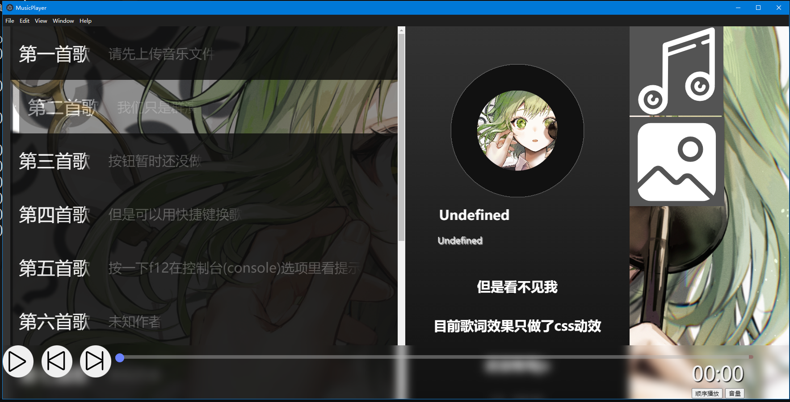
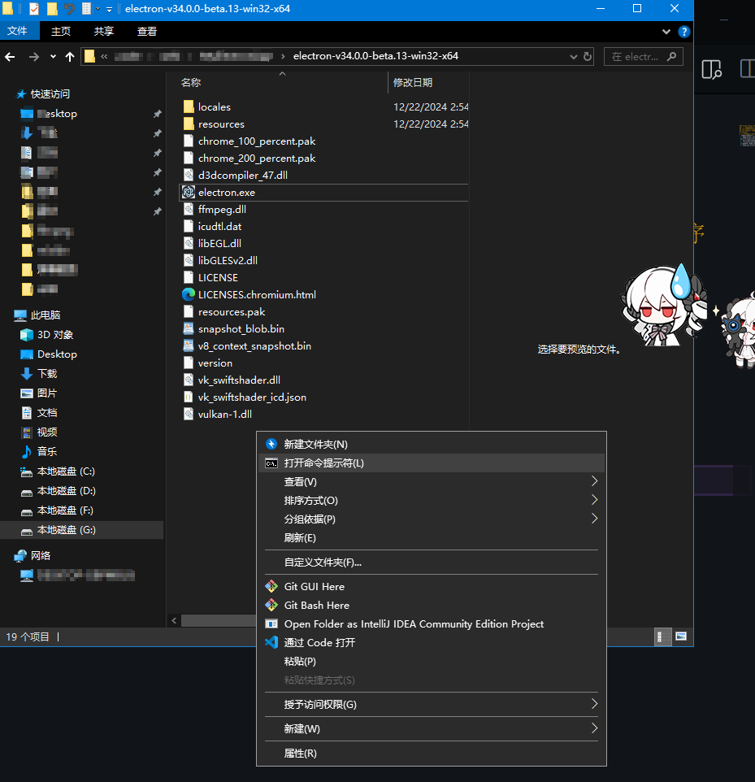
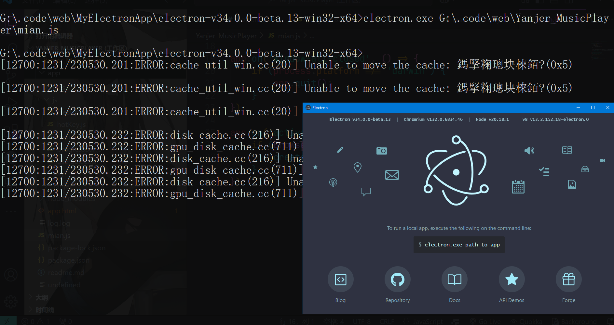

# Yanjer Music Player
### 基于web的音乐播放器，将使用electron进行Windows系统的exe打包

**[演示视频](https://www.bilibili.com/video/BV15vkaYtEgf/)**\
*(目前还没有学会electron的打包，先放着，以后再说)*\
可以通过本地下载好的electron软件直接运行main.js文件实现exe打开程序\
node_modules文件夹内的模块需要手动安装(npm install)

## 项目进度说明
很多东西还能优化  后面会
- 把用input输入文件直接变成调用文件那套API
- 封面上传算法优化(在文件注释里)
- 文件夹信息储存(配置文件)(见test/info.json)
- !优化播放算法 (*原方法直接全部创建dataURL容易造成内存溢出 后续改成转码base64存储 要用时临时转成blob然后放入audio的src 结束就释放*)
- 优化界面(3D效果 还有一些有的没的)
- 功能完善(音量滑块 歌词等)
# electron运行教程
使用包管理器安装在国内可能出现很多网络问题(至少我不行)
所以可以直接下载[离线包](https://github.com/electron/electron/releases/download/v11.0.3/electron-v11.0.3-win32-x64.zip)
 1. 使用包管理器或直接下载(包管理器下载教程自行搜索 不同包管理器语法不同)
 2. 下载到任意目录  无需配置系统环境变量
 3. 在electron目录下打开cmd\
 (在文件夹中页面任意空白处右击 选择打开任务管理器)
 
 4. 输入`electron.exe Path/main.js` (path为main.js文件所在的路径)\
 e.g. `$ electron.exe D:\Yanjer_MusicPlayer\main.js`\
 
 5. 等待程序运行完成后，会生成一个exe进程 内容为此web项目(无需打开electron.exe 打开后显示的是如图右下角的窗口)
